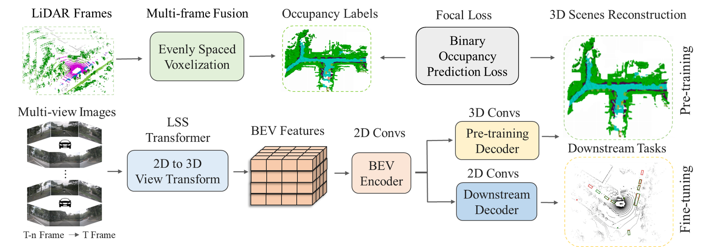

# Multi-Camera Unified Pre-training via 3D Scene Reconstruction 
(for DETR3D, BEVFormer, BEVDet, BEVDepth and Semantic Occupancy Prediction)

> [Paper in arXiv](https://arxiv.org/abs/2305.18829) 

# Abstract
Multi-camera 3D perception has emerged as a prominent research field in autonomous driving, offering a viable and cost-effective alternative to LiDAR-based solutions. The existing multi-camera algorithms primarily rely on monocular 2D pre-training. However, the monocular 2D pre-training overlooks the spatial and temporal correlations among the multi-camera system. To address this limitation, we propose the first multi-camera unified pre-training framework, called UniScene, which involves initially reconstructing the 3D scene as the foundational stage and subsequently fine-tuning the model on downstream tasks. Specifically, we employ Occupancy as the general representation for the 3D scene, enabling the model to grasp geometric priors of the surrounding world through pre-training.

# Methods



# Getting Started
- [Installation](docs/install.md) 
- [Prepare Dataset](docs/prepare_dataset.md)
- [Run and Eval](docs/getting_started.md)

# Model Zoo

| Backbone | Method | Pre-training | Lr Schd | NDS| mAP| Config |
| :---: | :---: | :---: | :---: | :---:| :---: | :---: |
| R101-DCN  | [BEVFormer](https://github.com/fundamentalvision/BEVFormer) | ImageNet | 24ep | 47.7 | 37.7 |  [config](BEVFormer/projects/configs/bevformer/bevformer_base.py)/[model] |
| R101-DCN  | [BEVFormer](https://github.com/fundamentalvision/BEVFormer) | ImageNet + UniScene | 24ep | 50.0 | 39.7 |  [config](BEVFormer/projects/configs/bevformer/bevformer_base.py)/[model](https://drive.google.com/file/d/1G4Z2eNJMtMzuAl-43vXzytyZG7t-RBQk/view?usp=drive_link) |
| R101-DCN  | [BEVFormer](https://github.com/fundamentalvision/BEVFormer) | FCOS3D | 24ep | 51.7 | 41.6 | [config](BEVFormer/projects/configs/bevformer/bevformer_base.py)/[model](https://github.com/zhiqi-li/storage/releases/download/v1.0/bevformer_r101_dcn_24ep.pth) |
| R101-DCN  |  [BEVFormer](https://github.com/fundamentalvision/BEVFormer) | FCOS3D + UniScene | 24ep | 53.4 |43.8 |[config](projects/configs/bevformer/occ_bev_sweep2.py)/[pre-trained model](https://drive.google.com/file/d/1tXylQhYLAH6c-gAJD0dUeZxwOPUD4rZX/view?usp=drive_link)/[fine-tune-model](https://drive.google.com/file/d/1DkaS2QD8tKHM59SJu8WGaz-ZsObzbeZ4/view?usp=drive_link)|


# Bibtex
If this work is helpful for your research, please consider citing the following BibTeX entry.

```
@article{occ-bev,
  title={Multi-Camera Unified Pre-training via 3D Scene Reconstruction},
  author={Chen Min, Liang Xiao, Dawei Zhao, Yiming Nie, and Bin Dai}
  journal={arXiv preprint},
  year={2023}
}
```

# Acknowledgement

Many thanks to these excellent open source projects:
- [Occ3D](https://github.com/CVPR2023-3D-Occupancy-Prediction/CVPR2023-3D-Occupancy-Prediction) 

- [occupancy-for-nuscenes](https://github.com/FANG-MING/occupancy-for-nuscenes)

- [DETR3D](https://github.com/WangYueFt/detr3d) 

- [BEVFormer](https://github.com/fundamentalvision/BEVFormer) 

- [BEVDet](https://github.com/HuangJunJie2017/BEVDet)

- [BEVDepth](https://github.com/Megvii-BaseDetection/BEVDepth)

  
